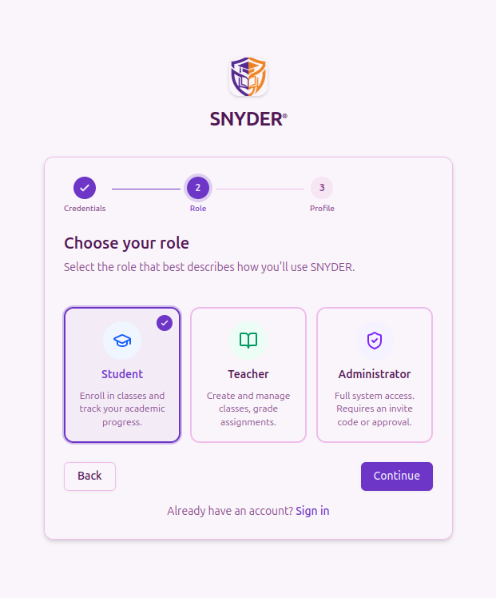

# PERNstack-ManagementDashboard

A full-stack administration dashboard built with the PERN stack, designed to provide user authentication, role-based access, and management functionality through a modern web interface.

Overview

The PERN Stack Admin Dashboard is a full-stack web application built with React and TypeScript on the frontend and Node.js, Express, PostgreSQL, and Drizzle ORM on the backend.

The project demonstrates practical experience in full-stack development, authentication, database management, API development, role-based authorization, and modern frontend development.

Features
User registration and sign-in
Email/password authentication
Session-based authentication with Better Auth
Role-based access control
Student, teacher, and admin roles
Dashboard interface
User management
Classes management
Departments management
Enrollments management
Faculty management
Subjects management
REST API backend
PostgreSQL database
Database schema and migrations using Drizzle ORM
Form validation
Responsive user interface
Cloudinary integration for image management
Tech Stack
Frontend
React 19
TypeScript
Vite
Refine
Tailwind CSS 4
shadcn/ui
React Hook Form
Zod
React Router
Lucide
Better Auth Client
Backend
Node.js
Express 5
TypeScript
REST APIs
Better Auth
CORS
Database
PostgreSQL
Drizzle ORM
Drizzle Kit
Other Tools & Services
Git
GitHub
Cloudinary
Arcjet
APM Insight
Project Structure
PERNstack-AdminDashboard/
│
├── FRONTEND/
│   ├── src/
│   │   ├── components/
│   │   ├── lib/
│   │   ├── pages/
│   │   │   ├── dashboard/
│   │   │   ├── login/
│   │   │   ├── register/
│   │   │   ├── classes/
│   │   │   ├── departments/
│   │   │   ├── enrollments/
│   │   │   ├── faculty/
│   │   │   └── subjects/
│   │   └── providers/
│   │
│   └── ...
│
├── BACKEND/
│   ├── src/
│   │   ├── config/
│   │   ├── db/
│   │   │   ├── schema/
│   │   │   └── lib/
│   │   ├── middleware/
│   │   └── routes/
│   │
│   └── ...
│
└── README.md
Authentication & Authorization

Authentication is implemented using Better Auth with email/password authentication.

The application uses PostgreSQL and Drizzle ORM for authentication-related data and supports different user roles:

Student
Teacher
Admin

Role-based authorization is used to control access to administrative functionality.

Database

The application uses PostgreSQL as its primary database and Drizzle ORM for database operations and schema management.

The authentication schema includes user, session, account, and verification data, together with application-specific user information such as roles and profile images.

Getting Started
Prerequisites

Make sure you have:

Node.js
npm
PostgreSQL
Git
Clone the repository
git clone https://github.com/snyderphina-com/PERNstack-AdminDashboard.git

cd PERNstack-AdminDashboard
Frontend
cd FRONTEND
npm install
npm run dev
Backend

Open another terminal:

cd BACKEND
npm install
npm run dev
Environment Variables

The frontend and backend require environment variables for configuration.

Create the appropriate environment files and provide the required values for your local environment.

Do not commit .env files or secret credentials to GitHub.

Application Pages

The frontend currently includes interfaces for:

Dashboard
Login
Registration
Classes
Departments
Enrollments
Faculty
Subjects
What I Learned

This project helped me develop practical experience with:

Full-stack web development
React and TypeScript
REST API development
PostgreSQL database design
Drizzle ORM
Authentication and sessions
Role-based access control
Form handling and validation
Frontend/backend integration
Git and GitHub
Deployment and production debugging
Environment variable management
Future Improvements
Expand administrative functionality
Improve dashboard analytics
Add more comprehensive testing
Continue improving UI/UX
Strengthen application security and validation
Author

Euphine Snyder Atieno

GitHub: https://github.com/snyderphina-com
